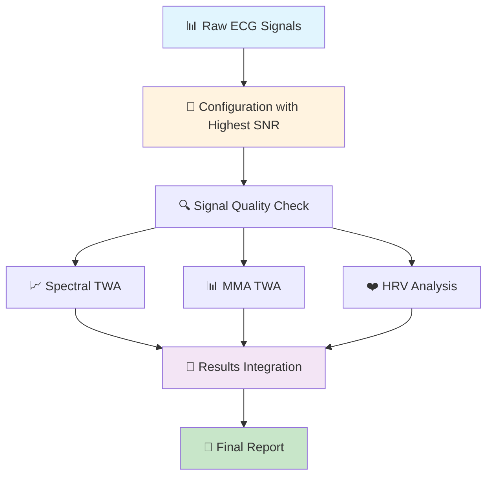

# ECG-Analysis

[](https://www.gnu.org/licenses/gpl-3.0)
[](https://physionet.org/content/twanalyser/1.0.0/)

A comprehensive MATLAB pipeline for T-Wave Alternans (TWA) analysis featuring spectral and modified moving average (MMA) methods with integrated HRV analysis and Brainstorm integration.

## 📖 Citation & Attribution

### Based On
This implementation extends the TWA Analyzer by Khaustov A.:
- **Original**: Khaustov, A. (2008). [TWA Analyzer on PhysioNet](https://physionet.org/content/twanalyser/1.0.0/)
- **Publication**: [DOI](https://doi.org/10.1109/CIC.2008.4749090) 
- **License**: GNU General Public License (GPL).
- **Modifications**: Ege Bozdag & Navaneethakrishna Makaram (2025) - Code restructuring, documentation improvements, ECGdeli/HRVTool/Brainstorm integration

## ✨ Features

- **Dual TWA Methods**: Spectral analysis & Modified Moving Average (MMA)
- **Signal Quality Assessment**: Automatic bad segment detection
- **HRV Integration**: Comprehensive heart rate variability metrics
- **Multi-channel Support**: Automatic optimal channel selection
- **Brainstorm Integration**: Seamless EEG/ECG data workflow
- **Professional Visualization**: Event marking and result exporting

## 📦 Dependencies

Please install separately and add to MATLAB path:

+ **ECGdeli** - ECG delineation & Filtering - Install from [repository](https://github.com/KIT-IBT/ECGdeli)
+ **HRVTool** - Heart rate variability - Install from [repository](https://github.com/MarcusVollmer/HRV) • [Documentation](https://marcusvollmer.github.io/HRV)
+ **Brainstorm** - Data management & visualization - Install from [repository](https://github.com/brainstorm-tools/brainstorm3) • [Documentation](https://neuroimage.usc.edu/brainstorm/Introduction)

## 🏗️ Pipeline Architecture



### Usage Examples
```markdown
## 💻 Usage Examples

### Basic TWA Analysis
```
```matlab
% Load your ECG data
ecg = your_ecg_data;  % [samples × channels]
Fs = 1000;  % Sampling frequency
time = (0:length(ecg)-1)/Fs;


% Run complete analysis
[final_table,T_spectral,T_MMA,T_bad] = TWA_Calculator(ecg,time,Fs);
```

### Output Description

|         Metric          |             Description                                      |  Units   |
|-------------------------|--------------------------------------------------------------|----------|
| final_table.Spec_Max    |  Maximum spectral TWA amplitude                              | μV       |
| final_table.Spec_Median |  Median spectral TWA amplitude                               | μV       |
| final_table.MMA_Max     |  Maximum MMA TWA amplitude as coded by Khaustov et al.       | μV       |
| final_table.MMA_Median  |  Median MMA TWA amplitude as coded by Khaustov et al.        | μV       |
| final_table.HR          |  Average heart rate                                          | BPM      |
| final_table.HRV_SDNN    |  HRV : standard deviation of the normal to normal intervals  | ms       |
| final_table.HRV_RMSSD   |  HRV : root mean square of successive differences            | ms       |
| final_table.HRV_rrHRV   |  HRV : RR interval based HRV                                 | unitless | [see](https://marcusvollmer.github.io/HRV/files/paper_method.pdf)
| T_spectral              |  Spectral TWA amplitudes                                     | μV       |
| T_MMA                   |  MMA TWA amplitude as coded by Khaustov et al.               | μV       |
| T_bad                   |  Bad segment  information after filtering                    |          |  

### TWA Analysis with the Brainstorm Software
It is important to name ECG channels as ECG or EKG.
- Drag and Drop functionality within "Brainstorm" user interface will be explained with pictures soon

Run 'Main_Brainstorm.m'


### Important Information

Implementaition of Khaustov et al define MMA TWA with absolute mean differences of running averages as 

TWARes.res(intv).VAlt(lead) = abs(mean(df)); %ma; [Source](https://physionet.org/content/twanalyser/1.0.0/twa-mfiles/TWAbyMMAOnAFile.m)

To Have similar definition with the literature, please change *TWAMMA_calculator* in helper functions line 134 to 

TWARes.res(intv).VAlt(lead) = ma;
